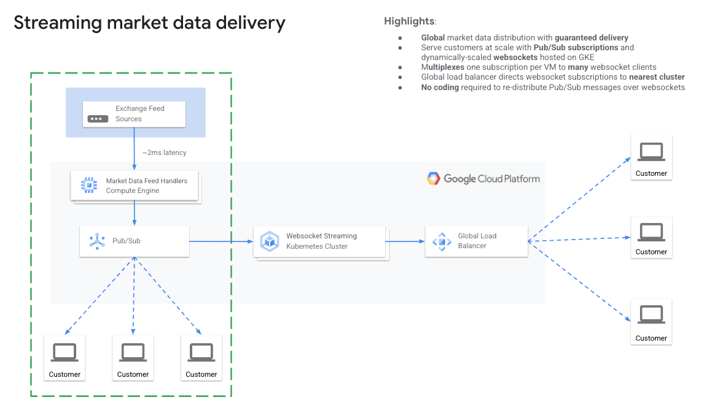
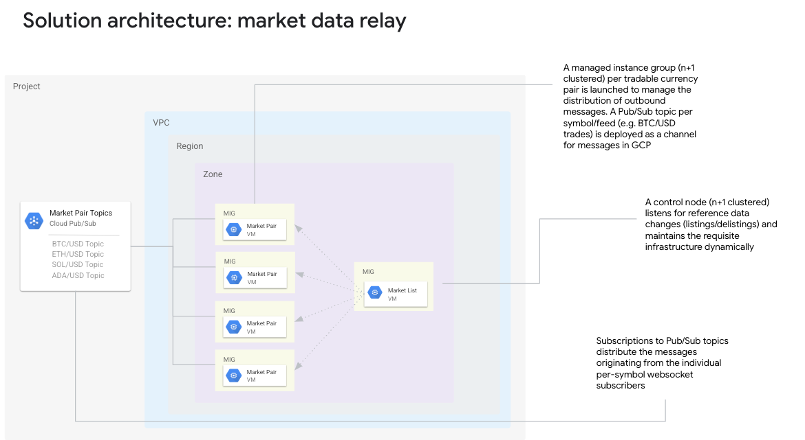

# websocket-to-pubsub-ingest
The websocket-to-pubsub-ingest adapter provides an easy way to ingest websocket streaming data into Pub/Sub topics in Google Cloud. 


## How it works

The goal is split the original websocket stream and send the messages to PubSub topics.  In the diagram below, this project is the part that is highlighted in the green box.



There are 2 MIG types, a `market list` MIG and a `market pair` MIG.  A MIG is a managed instance group, which is like a VM with extra configuration around it.



 * marketlist - The `market list` MIG will connect to the websocket, subscribe to the market channel, and retrieve a list of market pairs.  For each market pair, it will launch a `market pair` MIG.  It will remain connected to the websocket.  When a new market pair comes on line, it will notice it and launch a `market pair` component for the new pair.
   * Components
     * Script: startup script and subscribeToMarketChannel.js
     * Instance template: `market-list-instance-template`
     * Instance group: subscribe-marketlist-ig

 * marketpair - One `market pair` MIG is launched per market pair.  It will connect to the websocket, subscribe to the ticker, trades and orderbook channels for that marketpair, and then publish each message to a matching PubSub topic. If the topic does not exist for the market pair and channel, it will create one before publishing to it.  
   * Components
     * Script: startup script and subscribeToMarketPairChannels.js
     * Instance template: `market-pair-instance-template`
     * Instance group: subscribe-marketpair-{market-pair}-ig (example: subscribe-marketpair-btc-usd-ig)

## Before you begin

- [Select or create a Cloud Platform project](https://console.cloud.google.com/project).
- [Enable billing for your project](https://support.google.com/cloud/answer/6293499#enable-billing).
- [Enable the Google Cloud Pub/Sub API](https://console.cloud.google.com/flows/enableapi?apiid=pubsub.googleapis.com).
- [Set up authentication with a service account so you can access the API from your local workstation](https://cloud.google.com/docs/authentication/getting-started).
- Confirm service account has these roles or equivalent privileges:
  * Cloud Pub/Sub Service Agent
  * Compute Engine Service Agent
  * Compute Instance Admin (v1)
  * Compute Instance Admin (beta)
  * Service Account User

  https://cloud.google.com/iam/docs/impersonating-service-accounts#impersonate-sa-level

- Check on project quotas.  Due to the number of market pair instances that could be created, be aware of the following quotas which could prevent all of the components from being created.  There should be enough allocated to accomodate as many market pairs you want to support. 
  * Compute Engine API
    * In-use IP addresses
    * CPUs
    * Backend services
    * Managed instance groups


## Run as MIG Setup

Do the following steps to setup the MIGs

1) Create `market list` instance template
2) Create `market pair` instance template
3) Create `market list` instance group


### 1) Create `market list` instance template

Do the following steps to deploy the market list instance template

####  1a) Customize the startup script

Open the startup script [startup-scripts/market-list-instance-template-startup.sh](startup-scripts/market-list-instance-template-startup.sh).  Set the variables to match your environment.

 * ZONE - zone to deploy the MIGs to
 * MKT_PAIR_INSTANCE_TEMPLATE - instance template for market pairs: market-pair-instance-template
 * WS_URL - websocket url
 * TOPIC_PREFIX - full prefix for topic names
 * MKT_PAIR_LIST_LIMIT - Gets first n pairs from the list.  Or use -1 for all
 * DEBUG - output extra debug messages


#### 1b) Create the `market-list-instance-template` instance template 

Create the instance template using the gCloud command below.  Note that this will reference the startup script from the previous step. (Note that this can also be done manually through the [console](https://cloud.google.com/compute/docs/instance-templates/create-instance-templates#console)

Before running the gcloud command, set the following environment variables:
 * PROJECT_NAME - service account to use
 * ZONE - zone to deploy the MIGs to
 * MACHINE_TYPE - VM shape to use
 * SERVICE_ACCOUNT - service account that the VM runs with (see IAM for default compute engine SA)


Note: If you need the VM to not have a public IP address, remove the `address=` value from the `--network-interface` parameter in the gcloud command below.  The value would then be: `--network-interface=network=default,network-tier=PREMIUM`

```
export PROJECT_NAME=xxxxxx
export ZONE=us-central1-a
export MACHINE_TYPE=e2-small
export SERVICE_ACCOUNT=xxxxxxxx-compute@developer.gserviceaccount.com

gcloud compute instance-templates create market-list-instance-template --project=$PROJECT_NAME --machine-type=$MACHINE_TYPE --network-interface=network=default,address=,network-tier=PREMIUM --metadata-from-file=startup-script=startup-scripts/market-list-instance-template-startup.sh --metadata=enable-oslogin=true --maintenance-policy=MIGRATE --provisioning-model=STANDARD --service-account=$SERVICE_ACCOUNT --scopes=https://www.googleapis.com/auth/cloud-platform,https://www.googleapis.com/auth/pubsub,https://www.googleapis.com/auth/source.read_only,https://www.googleapis.com/auth/compute,https://www.googleapis.com/auth/servicecontrol,https://www.googleapis.com/auth/service.management.readonly,https://www.googleapis.com/auth/logging.write,https://www.googleapis.com/auth/monitoring.write,https://www.googleapis.com/auth/trace.append,https://www.googleapis.com/auth/devstorage.read_only,https://www.googleapis.com/auth/userinfo.email --create-disk=auto-delete=yes,boot=yes,device-name=market-list-instance-template,image=projects/ubuntu-os-cloud/global/images/ubuntu-2004-focal-v20220712,mode=rw,size=20,type=pd-balanced --shielded-secure-boot --shielded-vtpm --shielded-integrity-monitoring --reservation-affinity=any

```

Confirm through the [console](https://pantheon.corp.google.com/compute/instanceTemplates/list) that the instance template was created.


### 2) Create `market pair` instance template

Do the following steps to deploy the market pair instance template

####  2a) Customize the startup script

Open the startup script [startup-scripts/market-pair-instance-template-startup.sh](startup-scripts/market-pair-instance-template-startup.sh).  Set the variables to match your environment.

 * WS_URL - websocket url
 * TOPIC_PREFIX - full prefix for topic names
 * DEBUG - output extra debug messages


#### 2b) Create the `market-pair-instance-template` instance template 

Create the instance template using the gCloud command below.  Note that this will reference the startup script from the previous step. (Note that this can also be done manually through the [console](https://cloud.google.com/compute/docs/instance-templates/create-instance-templates#console)

Before running the gcloud command, set the following environment variables:
 * PROJECT_NAME - project name
 * ZONE - zone to deploy the MIGs to
 * MACHINE_TYPE - VM shape to use
 * SERVICE_ACCOUNT - service account that the VM runs with (see IAM for default compute engine SA)

Note: If you need the VM to not have a public IP address, remove the `address=` value from the `--network-interface` parameter in the gcloud command below.  The value would then be: `--network-interface=network=default,network-tier=PREMIUM`

```
export PROJECT_NAME=xxxxxx
export ZONE=us-central1-a
export MACHINE_TYPE=e2-small
export SERVICE_ACCOUNT=xxxxxxxx-compute@developer.gserviceaccount.com

gcloud compute instance-templates create market-pair-instance-template --project=$PROJECT_NAME --machine-type=$MACHINE_TYPE --network-interface=network=default,address=,network-tier=PREMIUM --metadata-from-file=startup-script=startup-scripts/market-pair-instance-template-startup.sh --metadata=enable-oslogin=true --maintenance-policy=MIGRATE --provisioning-model=STANDARD --service-account=$SERVICE_ACCOUNT --scopes=https://www.googleapis.com/auth/cloud-platform,https://www.googleapis.com/auth/pubsub,https://www.googleapis.com/auth/source.read_only,https://www.googleapis.com/auth/compute,https://www.googleapis.com/auth/servicecontrol,https://www.googleapis.com/auth/service.management.readonly,https://www.googleapis.com/auth/logging.write,https://www.googleapis.com/auth/monitoring.write,https://www.googleapis.com/auth/trace.append,https://www.googleapis.com/auth/devstorage.read_only,https://www.googleapis.com/auth/userinfo.email --create-disk=auto-delete=yes,boot=yes,device-name=market-pair-instance-template,image=projects/ubuntu-os-cloud/global/images/ubuntu-2004-focal-v20220712,mode=rw,size=20,type=pd-balanced --shielded-secure-boot --shielded-vtpm --shielded-integrity-monitoring --reservation-affinity=any

```

Confirm through the [console](https://pantheon.corp.google.com/compute/instanceTemplates/list) that the instance template was created.


### 3) Create the `market list` MIG

THe following commands will create the `market list` MIG.  Once the `market list` MIG is created, it will launch the process that will retrieve the list of market pairs, and then create a new MIG for each market pair.  


Create the MIG
```
export PROJECT_NAME=xxxxx
export INSTANCE_TEMPLATE=market-list-instance-template
export ZONE=us-central1-a

gcloud compute instance-groups managed create subscribe-marketlist-ig --project=$PROJECT_NAME --base-instance-name=subscribe-marketlist-ig --size=1 --template=$INSTANCE_TEMPLATE --zone=$ZONE
```

Create the autoscaling attributes
```
gcloud beta compute instance-groups managed set-autoscaling subscribe-marketlist-ig --project=$PROJECT_NAME --zone=$ZONE --cool-down-period=60 --max-num-replicas=1 --min-num-replicas=1 --mode=off --target-cpu-utilization=1.0
```

*Note that this MIG will create MIGS for all the market pairs*

You will notice that shortly after launching this MIG, marketpair MIGS will be created.  Once the marketpair MIGS are created, matching PubSub topics will be created


### Create the `market pair` MIG (optional)

 * subscribe-marketpair-btc-usd-ig

**This step is only necessary if you want to create a MIG manually for a specific market pair.  Otherwise, they will all be created by the `subscribe-marketlist-ig` MIG when it starts**


The name of each instance group needs to have the market pair in the name.  Use a naming convention.  Use the gcloud commands below or the [console](https://cloud.google.com/compute/docs/instance-groups/create-zonal-mig#console)

Create the MIG
```
export PROJECT_NAME=xxxxx
export INSTANCE_TEMPLATE=market-pair-instance-template
export ZONE=us-central1-a
EXPORT MKT_PAIR=btc-usd

gcloud compute instance-groups managed create subscribe-marketpair-$MKT_PAIR-ig --project=$PROJECT_NAME --base-instance-name=subscribe-marketpair-btc-usd-ig --size=1 --template=$INSTANCE_TEMPLATE --zone=$ZONE
```

Create the autoscaling attributes
```
gcloud beta compute instance-groups managed set-autoscaling subscribe-marketpair-btc-usd-ig --project=$PROJECT_NAME --zone=$ZONE --cool-down-period=30 --max-num-replicas=1 --min-num-replicas=1 --mode=off --target-cpu-utilization=1.0
```
 
### Test

 * Check logs in the market list VM
   * ssh into the market list VM.  The path for the log file is 
```
/var/marketfeed/websocket-to-pubsub-ingest/output.log
```
 * Check if all MIGS have been created: [https://console.cloud.google.com/compute/instanceGroups/list](https://console.cloud.google.com/compute/instanceGroups/list)
 * Check if all PubSub topics have been created: [https://console.cloud.google.com/cloudpubsub/topic/list](https://console.cloud.google.com/cloudpubsub/topic/list)
 * Run the pulltop command to see if messages are getting published to the topic

```
export PROJECT_NAME=xxx
export TOPIC_NAME=xxx

npm install -g pulltop
pulltop projects/$PROJECT_NAME/topics/$TOPIC_NAME
```

## Disclaimers

  
_This is not an officially supported Google product._

  
The `websocket-to-pubsub-ingest` is under active development. Interfaces and functionality may change at any time.


## License


This repository is licensed under the Apache 2 license (see [LICENSE](LICENSE.txt)).

Contributions are welcome. See [CONTRIBUTING](CONTRIBUTING.md) for more information. 


